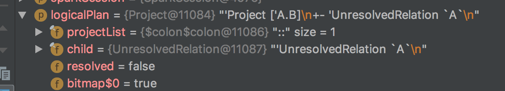
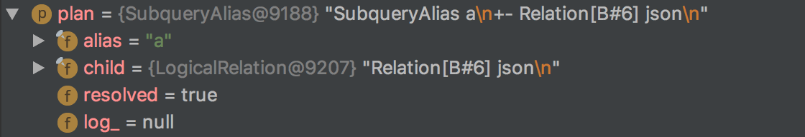

spark sql 2.3 源码解读 -  Analyzer (3.2)

根据上一节所讲，Analyzer最关键的代码便是rule的实现了。

先整体看一下rule的集合：

```
lazy val batches: Seq[Batch] = Seq(
  Batch("Hints", fixedPoint,
    new ResolveHints.ResolveBroadcastHints(conf),
    ResolveHints.RemoveAllHints),
  Batch("Simple Sanity Check", Once,
    LookupFunctions),
  Batch("Substitution", fixedPoint,
    CTESubstitution,
    WindowsSubstitution,
    EliminateUnions,
    new SubstituteUnresolvedOrdinals(conf)),
  Batch("Resolution", fixedPoint,
    ResolveTableValuedFunctions ::
    ResolveRelations ::
    ResolveReferences ::
    ResolveCreateNamedStruct ::
    ResolveDeserializer ::
    ResolveNewInstance ::
    ResolveUpCast ::
    ResolveGroupingAnalytics ::
    ResolvePivot ::
    ResolveOrdinalInOrderByAndGroupBy ::
    ResolveAggAliasInGroupBy ::
    ResolveMissingReferences ::
    ExtractGenerator ::
    ResolveGenerate ::
    ResolveFunctions ::
    ResolveAliases ::
    ResolveSubquery ::
    ResolveSubqueryColumnAliases ::
    ResolveWindowOrder ::
    ResolveWindowFrame ::
    ResolveNaturalAndUsingJoin ::
    ExtractWindowExpressions ::
    GlobalAggregates ::
    ResolveAggregateFunctions ::
    TimeWindowing ::
    ResolveInlineTables(conf) ::
    ResolveTimeZone(conf) ::
    ResolvedUuidExpressions ::
    TypeCoercion.typeCoercionRules(conf) ++
    extendedResolutionRules : _*),
  Batch("Post-Hoc Resolution", Once, postHocResolutionRules: _*),
  Batch("View", Once,
    AliasViewChild(conf)),
  Batch("Nondeterministic", Once,
    PullOutNondeterministic),
  Batch("UDF", Once,
    HandleNullInputsForUDF),
  Batch("FixNullability", Once,
    FixNullability),
  Batch("Subquery", Once,
    UpdateOuterReferences),
  Batch("Cleanup", fixedPoint,
    CleanupAliases)
)
```

下面的rule会根据不同的SessionState而不同(BaseSessionStateBuilder,HiveSessionStateBuilder)

```
protected def analyzer: Analyzer = new Analyzer(catalog, conf) {
  override val extendedResolutionRules: Seq[Rule[LogicalPlan]] =
    new FindDataSourceTable(session) +:
      new ResolveSQLOnFile(session) +:
      customResolutionRules

  override val postHocResolutionRules: Seq[Rule[LogicalPlan]] =
    PreprocessTableCreation(session) +:
      PreprocessTableInsertion(conf) +:
      DataSourceAnalysis(conf) +:
      customPostHocResolutionRules

  override val extendedCheckRules: Seq[LogicalPlan => Unit] =
    PreWriteCheck +:
      PreReadCheck +:
      HiveOnlyCheck +:
      customCheckRules
}
```

我们在上一章得到的 Unresolved Logical Plan为：



​    里面有一个UnresolvedRelation，所以我们看一下这个rule，看他的注释，将UnresolvedRelation替换为SessionCatalog中的真实的数据表信息。

   在这里打断一下，插入一个对TreeNode的介绍，transformDown 和 transformUp方法，都是对树进行遍历并对每个节点执行rule：

```
// 相当于先序遍历树
/**
 * Returns a copy of this node where `rule` has been recursively applied to it and all of its
 * children (pre-order). When `rule` does not apply to a given node it is left unchanged.
 *
 * @param rule the function used to transform this nodes children
 */
def transformDown(rule: PartialFunction[BaseType, BaseType]): BaseType = {
  val afterRule = CurrentOrigin.withOrigin(origin) {
    rule.applyOrElse(this, identity[BaseType])
  }

  // Check if unchanged and then possibly return old copy to avoid gc churn.
  if (this fastEquals afterRule) {
    mapChildren(_.transformDown(rule))
  } else {
    afterRule.mapChildren(_.transformDown(rule))
  }
}
// 相当于后序遍历树
/**
 * Returns a copy of this node where `rule` has been recursively applied first to all of its
 * children and then itself (post-order). When `rule` does not apply to a given node, it is left
 * unchanged.
 *
 * @param rule the function use to transform this nodes children
 */
def transformUp(rule: PartialFunction[BaseType, BaseType]): BaseType = {
  val afterRuleOnChildren = mapChildren(_.transformUp(rule))
  if (this fastEquals afterRuleOnChildren) {
    CurrentOrigin.withOrigin(origin) {
      rule.applyOrElse(this, identity[BaseType])
    }
  } else {
    CurrentOrigin.withOrigin(origin) {
      rule.applyOrElse(afterRuleOnChildren, identity[BaseType])
    }
  }
}
```

继续接着看UnresolvedRelation:

```
/**
 * Replaces [[UnresolvedRelation]]s with concrete relations from the catalog.
 */
object ResolveRelations extends Rule[LogicalPlan] {
  // 在catelog中匹配table信息
  def resolveRelation(plan: LogicalPlan): LogicalPlan = plan match {
    case u: UnresolvedRelation if !isRunningDirectlyOnFiles(u.tableIdentifier) =>
      // 默认数据库
      val defaultDatabase = AnalysisContext.get.defaultDatabase
      // 在catalog中查找
      val foundRelation = lookupTableFromCatalog(u, defaultDatabase)
      resolveRelation(foundRelation)
    // The view's child should be a logical plan parsed from the `desc.viewText`, the variable
    // `viewText` should be defined, or else we throw an error on the generation of the View
    // operator.
    case view @ View(desc, _, child) if !child.resolved =>
      // Resolve all the UnresolvedRelations and Views in the child.
      val newChild = AnalysisContext.withAnalysisContext(desc.viewDefaultDatabase) {
        if (AnalysisContext.get.nestedViewDepth > conf.maxNestedViewDepth) {
          view.failAnalysis(s"The depth of view ${view.desc.identifier} exceeds the maximum " +
            s"view resolution depth (${conf.maxNestedViewDepth}). Analysis is aborted to " +
            s"avoid errors. Increase the value of ${SQLConf.MAX_NESTED_VIEW_DEPTH.key} to work " +
            "around this.")
        }
        executeSameContext(child)
      }
      view.copy(child = newChild)
    case p @ SubqueryAlias(_, view: View) =>
      val newChild = resolveRelation(view)
      p.copy(child = newChild)
    case _ => plan
  }

  // rule的入口，transformUp 后序遍历树，并对每个节点应用rule
  def apply(plan: LogicalPlan): LogicalPlan = plan.transformUp {
    case i @ InsertIntoTable(u: UnresolvedRelation, parts, child, _, _) if child.resolved =>
      EliminateSubqueryAliases(lookupTableFromCatalog(u)) match {
        case v: View =>
          u.failAnalysis(s"Inserting into a view is not allowed. View: ${v.desc.identifier}.")
        case other => i.copy(table = other)
      }
    // 匹配到UnresolvedRelation
    case u: UnresolvedRelation => resolveRelation(u)
  }

  // Look up the table with the given name from catalog. The database we used is decided by the
  // precedence:
  // 1. Use the database part of the table identifier, if it is defined;
  // 2. Use defaultDatabase, if it is defined(In this case, no temporary objects can be used,
  //    and the default database is only used to look up a view);
  // 3. Use the currentDb of the SessionCatalog.
  private def lookupTableFromCatalog(
      u: UnresolvedRelation,
      defaultDatabase: Option[String] = None): LogicalPlan = {
    val tableIdentWithDb = u.tableIdentifier.copy(
      database = u.tableIdentifier.database.orElse(defaultDatabase))
    try {
      catalog.lookupRelation(tableIdentWithDb)
    } catch {
      // 如果没有找到表，便会抛出异常了
      case e: NoSuchTableException =>
        u.failAnalysis(s"Table or view not found: ${tableIdentWithDb.unquotedString}", e)
      // If the database is defined and that database is not found, throw an AnalysisException.
      // Note that if the database is not defined, it is possible we are looking up a temp view.
      case e: NoSuchDatabaseException =>
        u.failAnalysis(s"Table or view not found: ${tableIdentWithDb.unquotedString}, the " +
          s"database ${e.db} doesn't exist.", e)
    }
  }
  
  private def isRunningDirectlyOnFiles(table: TableIdentifier): Boolean = {
    table.database.isDefined && conf.runSQLonFile && !catalog.isTemporaryTable(table) &&
      (!catalog.databaseExists(table.database.get) || !catalog.tableExists(table))
  }
}
```
```
// catalog 存储了spark sql的所有数据表信息
/**
 * An internal catalog that is used by a Spark Session. This internal catalog serves as a
 * proxy to the underlying metastore (e.g. Hive Metastore) and it also manages temporary
 * views and functions of the Spark Session that it belongs to.
 *
 * This class must be thread-safe.
 */
protected lazy val catalog: SessionCatalog = {
  val catalog = new SessionCatalog(
    session.sharedState.externalCatalog,
    session.sharedState.globalTempViewManager,
    functionRegistry,
    conf,
    SessionState.newHadoopConf(session.sparkContext.hadoopConfiguration, conf),
    sqlParser,
    resourceLoader)
  parentState.foreach(_.catalog.copyStateTo(catalog))
  catalog
}
```

我们看一下执行的结果：

```
=== Applying Rule org.apache.spark.sql.catalyst.analysis.Analyzer$ResolveRelations ===
 'Project ['A.B]              'Project ['A.B]
!+- 'UnresolvedRelation `A`   +- SubqueryAlias a
!                                +- Relation[B#6] json
```


resolved = true， Unresolved Logical Plan 转化为了 Resolved Logical Plan