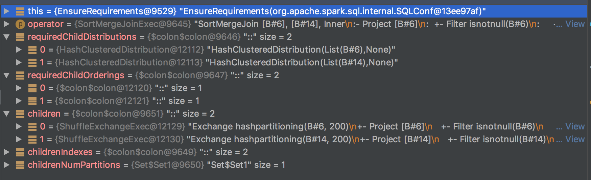
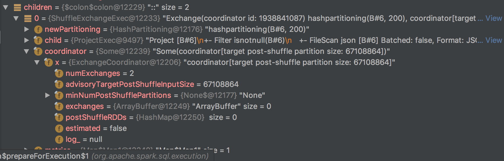
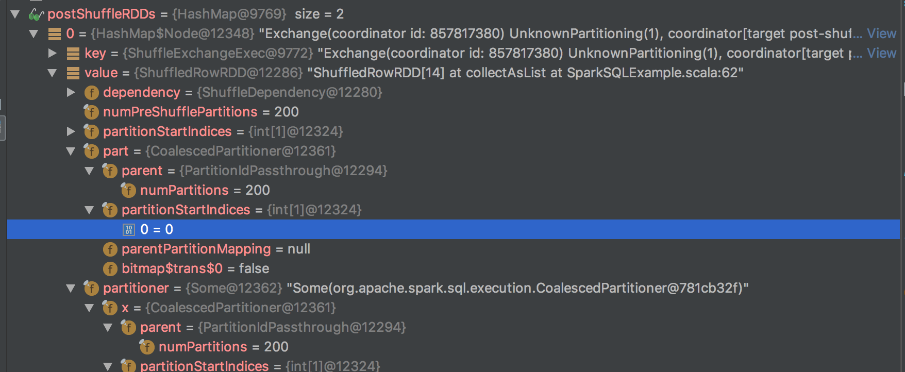

spark sql 2.3 源码解读 -  Execute (7)

终于到了最后一步执行了：

```
/** Internal version of the RDD. Avoids copies and has no schema */
lazy val toRdd: RDD[InternalRow] = executedPlan.execute()
```
```
final def execute(): RDD[InternalRow] = executeQuery {
    if (isCanonicalizedPlan) {
      throw new IllegalStateException("A canonicalized plan is not supposed to be executed.")
    }
    doExecute()
  }
```

```
protected final def executeQuery[T](query: => T): T = {
  RDDOperationScope.withScope(sparkContext, nodeName, false, true) {
    prepare()
    waitForSubqueries()
    query
  }
}
```

```
final def prepare(): Unit = {
  // doPrepare() may depend on it's children, we should call prepare() on all the children first.
  children.foreach(_.prepare())
  synchronized {
    if (!prepared) {
      prepareSubqueries()
      doPrepare()
      prepared = true
    }
  }
}
```

最关键的两个函数便是 doPrepare和 doExecute了。

还是以上一章的sql语句为例，其最终生成的sparkplan为：


```
*(2) Sort [B#6 ASC NULLS FIRST], true, 0
+- Exchange rangepartitioning(B#6 ASC NULLS FIRST, 200)
   +- *(1) FileScan json [B#6] Batched: false, Format: JSON, Location: InMemoryFileIndex[file:/Users/neal/github/spark2.3/spark/examples/src/main/resources/test.json], PartitionFilters: [], PushedFilters: [], ReadSchema: struct<B:string>
```
看一下SortExec的doPrepare 和 doExecute方法：

```
override protected def doPrepare(): Unit = {
  coordinator match {
    // 向exchangeCoordinator注册该exchange
    case Some(exchangeCoordinator) => exchangeCoordinator.registerExchange(this)
    case _ =>
  }
// 注册就是添加到array中
def registerExchange(exchange: ShuffleExchangeExec): Unit = synchronized {
    exchanges += exchange
  }
```

```
protected override def doExecute(): RDD[InternalRow] = {
  val peakMemory = longMetric("peakMemory")
  val spillSize = longMetric("spillSize")
  val sortTime = longMetric("sortTime")
  // 逻辑很简单，调用child的execute方法，然后对每个partition进行排序
  child.execute().mapPartitionsInternal { iter =>
    val sorter = createSorter()

    val metrics = TaskContext.get().taskMetrics()
    // Remember spill data size of this task before execute this operator so that we can
    // figure out how many bytes we spilled for this operator.
    val spillSizeBefore = metrics.memoryBytesSpilled
    // 排序
    val sortedIterator = sorter.sort(iter.asInstanceOf[Iterator[UnsafeRow]])
    sortTime += sorter.getSortTimeNanos / 1000000
    peakMemory += sorter.getPeakMemoryUsage
    spillSize += metrics.memoryBytesSpilled - spillSizeBefore
    metrics.incPeakExecutionMemory(sorter.getPeakMemoryUsage)

    sortedIterator
  }
}
```

下面看child也就是ShuffleExchangeExec：

```
protected override def doExecute(): RDD[InternalRow] = attachTree(this, "execute") {
  // Returns the same ShuffleRowRDD if this plan is used by multiple plans.
  // 有缓存则直接返回缓存
  if (cachedShuffleRDD == null) {
    cachedShuffleRDD = coordinator match {
      // 有exchangeCoordinator
      case Some(exchangeCoordinator) =>
        val shuffleRDD = exchangeCoordinator.postShuffleRDD(this)
        assert(shuffleRDD.partitions.length == newPartitioning.numPartitions)
        shuffleRDD
      // 没有exchangeCoordinator
      case _ =>
        val shuffleDependency = prepareShuffleDependency()
        preparePostShuffleRDD(shuffleDependency)
    }
  }
  cachedShuffleRDD
}
```

先看没有exchangeCoordinator的情况，

首先执行：

```
private[exchange] def prepareShuffleDependency()
  : ShuffleDependency[Int, InternalRow, InternalRow] = {
  ShuffleExchangeExec.prepareShuffleDependency(
    child.execute(), child.output, newPartitioning, serializer)
}
```

上面的方法会返回一个ShuffleDependency，ShuffleDependency中最重要的是rddWithPartitionIds，它决定了每一条InternalRow shuffle后的partition id：

```
// Now, we manually create a ShuffleDependency. Because pairs in rddWithPartitionIds
// are in the form of (partitionId, row) and every partitionId is in the expected range
// [0, part.numPartitions - 1]. The partitioner of this is a PartitionIdPassthrough.
val dependency =
  new ShuffleDependency[Int, InternalRow, InternalRow](
    rddWithPartitionIds,
    new PartitionIdPassthrough(part.numPartitions),
    serializer)
```

接下来：

```
private[exchange] def preparePostShuffleRDD(
    shuffleDependency: ShuffleDependency[Int, InternalRow, InternalRow],
    specifiedPartitionStartIndices: Option[Array[Int]] = None): ShuffledRowRDD = {
  // If an array of partition start indices is provided, we need to use this array
  // to create the ShuffledRowRDD. Also, we need to update newPartitioning to
  // update the number of post-shuffle partitions.
  // 如果specifiedPartitionStartIndices存在，它将决定shuffle后的分区情况
  // exchangeCoordinator 会用到specifiedPartitionStartIndices来实现功能
  specifiedPartitionStartIndices.foreach { indices =>
    assert(newPartitioning.isInstanceOf[HashPartitioning])
    newPartitioning = UnknownPartitioning(indices.length)
  }
  new ShuffledRowRDD(shuffleDependency, specifiedPartitionStartIndices)
}
```

返回结果是ShuffledRowRDD：

```
class ShuffledRowRDD(
    var dependency: ShuffleDependency[Int, InternalRow, InternalRow],
    specifiedPartitionStartIndices: Option[Array[Int]] = None)
  extends RDD[InternalRow](dependency.rdd.context, Nil) {

  // 分区数目
  private[this] val numPreShufflePartitions = dependency.partitioner.numPartitions
  // 每个partition的startIndice
  private[this] val partitionStartIndices: Array[Int] = specifiedPartitionStartIndices match {
    case Some(indices) => indices
    case None =>
      // When specifiedPartitionStartIndices is not defined, every post-shuffle partition
      // corresponds to a pre-shuffle partition.
      (0 until numPreShufflePartitions).toArray
  }
  // rdd 的partitioner
  private[this] val part: Partitioner =
    new CoalescedPartitioner(dependency.partitioner, partitionStartIndices)

  override def getDependencies: Seq[Dependency[_]] = List(dependency)

  override val partitioner: Option[Partitioner] = Some(part)
  // 获取所有的partition
  override def getPartitions: Array[Partition] = {
    assert(partitionStartIndices.length == part.numPartitions)
    Array.tabulate[Partition](partitionStartIndices.length) { i =>
      val startIndex = partitionStartIndices(i)
      val endIndex =
        if (i < partitionStartIndices.length - 1) {
          partitionStartIndices(i + 1)
        } else {
          numPreShufflePartitions
        }
      new ShuffledRowRDDPartition(i, startIndex, endIndex)
    }
  }
}
```

CoalescedPartitioner的逻辑：

```
/**
 * A Partitioner that might group together one or more partitions from the parent.
 *
 * @param parent a parent partitioner
 // 这句注释将partitionStartIndices的作用讲的非常好
 * @param partitionStartIndices indices of partitions in parent that should create new partitions
 *   in child (this should be an array of increasing partition IDs). For example, if we have a
 *   parent with 5 partitions, and partitionStartIndices is [0, 2, 4], we get three output
 *   partitions, corresponding to partition ranges [0, 1], [2, 3] and [4] of the parent partitioner.
 */
class CoalescedPartitioner(val parent: Partitioner, val partitionStartIndices: Array[Int])
  extends Partitioner {
  // 实现 partition 的转换 
  @transient private lazy val parentPartitionMapping: Array[Int] = {
    val n = parent.numPartitions
    val result = new Array[Int](n)
    for (i <- 0 until partitionStartIndices.length) {
      val start = partitionStartIndices(i)
      val end = if (i < partitionStartIndices.length - 1) partitionStartIndices(i + 1) else n
      for (j <- start until end) {
        result(j) = i
      }
    }
    result
  }

  override def numPartitions: Int = partitionStartIndices.length

  override def getPartition(key: Any): Int = {
    parentPartitionMapping(parent.getPartition(key))
  }
}
```

再看有exchangeCoordinator的情况：

同样返回的是ShuffledRowRDD：

```
def postShuffleRDD(exchange: ShuffleExchangeExec): ShuffledRowRDD = {
  doEstimationIfNecessary()

  if (!postShuffleRDDs.containsKey(exchange)) {
    throw new IllegalStateException(
      s"The given $exchange is not registered in this coordinator.")
  }

  postShuffleRDDs.get(exchange)
}
```

再看doEstimationIfNecessary：

```
private def doEstimationIfNecessary(): Unit = synchronized {
  if (!estimated) {
    // Make sure we have the expected number of registered Exchange operators.
    assert(exchanges.length == numExchanges)

    val newPostShuffleRDDs = new JHashMap[ShuffleExchangeExec, ShuffledRowRDD](numExchanges)

    // Submit all map stages
    val shuffleDependencies = ArrayBuffer[ShuffleDependency[Int, InternalRow, InternalRow]]()
    val submittedStageFutures = ArrayBuffer[SimpleFutureAction[MapOutputStatistics]]()
    var i = 0
    // 依次执行每个注册的exchange的prepareShuffleDependency方法
    while (i < numExchanges) {
      val exchange = exchanges(i)
      val shuffleDependency = exchange.prepareShuffleDependency()
      shuffleDependencies += shuffleDependency
      if (shuffleDependency.rdd.partitions.length != 0) {
        // submitMapStage does not accept RDD with 0 partition.
        // So, we will not submit this dependency.
        submittedStageFutures +=
          exchange.sqlContext.sparkContext.submitMapStage(shuffleDependency)
      }
      i += 1
    }

    // Wait for the finishes of those submitted map stages.
    // 统计结果
    val mapOutputStatistics = new Array[MapOutputStatistics](submittedStageFutures.length)
    var j = 0
    while (j < submittedStageFutures.length) {
      // This call is a blocking call. If the stage has not finished, we will wait at here.
      mapOutputStatistics(j) = submittedStageFutures(j).get()
      j += 1
    }

    // Now, we estimate partitionStartIndices. partitionStartIndices.length will be the
    // number of post-shuffle partitions.
    // 得到partitionStartIndices
    val partitionStartIndices =
      if (mapOutputStatistics.length == 0) {
        None
      } else {
      // 根据 mapOutputStatistics 获取 partitionStartIndices
        Some(estimatePartitionStartIndices(mapOutputStatistics))
      }

    // 执行preparePostShuffleRDD，和没有exchangeCoordinator唯一的不同是有partitionStartIndices参数！
    var k = 0
    while (k < numExchanges) {
      val exchange = exchanges(k)
      val rdd =
        exchange.preparePostShuffleRDD(shuffleDependencies(k), partitionStartIndices)
      newPostShuffleRDDs.put(exchange, rdd)

      k += 1
    }

    // Finally, we set postShuffleRDDs and estimated.
    assert(postShuffleRDDs.isEmpty)
    assert(newPostShuffleRDDs.size() == numExchanges)
    // 结果放入缓存
    postShuffleRDDs.putAll(newPostShuffleRDDs)
    estimated = true
  }
}
```

estimatePartitionStartIndices 函数得到了 partitionStartIndices：

```
/**
 * Estimates partition start indices for post-shuffle partitions based on
 * mapOutputStatistics provided by all pre-shuffle stages.
 */
def estimatePartitionStartIndices(
    mapOutputStatistics: Array[MapOutputStatistics]): Array[Int] = {
  // If we have mapOutputStatistics.length < numExchange, it is because we do not submit
  // a stage when the number of partitions of this dependency is 0.
  assert(mapOutputStatistics.length <= numExchanges)

  // If minNumPostShufflePartitions is defined, it is possible that we need to use a
  // value less than advisoryTargetPostShuffleInputSize as the target input size of
  // a post shuffle task.
  // 每个partition的目标inputsize，即每个分区数据量的大小
  val targetPostShuffleInputSize = minNumPostShufflePartitions match {
    case Some(numPartitions) =>
      val totalPostShuffleInputSize = mapOutputStatistics.map(_.bytesByPartitionId.sum).sum
      // The max at here is to make sure that when we have an empty table, we
      // only have a single post-shuffle partition.
      // There is no particular reason that we pick 16. We just need a number to
      // prevent maxPostShuffleInputSize from being set to 0.
      val maxPostShuffleInputSize =
        math.max(math.ceil(totalPostShuffleInputSize / numPartitions.toDouble).toLong, 16)
      math.min(maxPostShuffleInputSize, advisoryTargetPostShuffleInputSize)

    case None => advisoryTargetPostShuffleInputSize
  }

  logInfo(
    s"advisoryTargetPostShuffleInputSize: $advisoryTargetPostShuffleInputSize, " +
    s"targetPostShuffleInputSize $targetPostShuffleInputSize.")

  // Make sure we do get the same number of pre-shuffle partitions for those stages.
  // 得到分区数，应该有且只有一个数值
  val distinctNumPreShufflePartitions =
    mapOutputStatistics.map(stats => stats.bytesByPartitionId.length).distinct
  // The reason that we are expecting a single value of the number of pre-shuffle partitions
  // is that when we add Exchanges, we set the number of pre-shuffle partitions
  // (i.e. map output partitions) using a static setting, which is the value of
  // spark.sql.shuffle.partitions. Even if two input RDDs are having different
  // number of partitions, they will have the same number of pre-shuffle partitions
  // (i.e. map output partitions).
  assert(
    distinctNumPreShufflePartitions.length == 1,
    "There should be only one distinct value of the number pre-shuffle partitions " +
      "among registered Exchange operator.")
  val numPreShufflePartitions = distinctNumPreShufflePartitions.head
  // 开始构建partitionStartIndices
  val partitionStartIndices = ArrayBuffer[Int]()
  // The first element of partitionStartIndices is always 0.
  partitionStartIndices += 0

  var postShuffleInputSize = 0L
 // 根据targetPostShuffleInputSize，对分区进行调整，会做一些合并之类的操作。
  var i = 0
  while (i < numPreShufflePartitions) {
    // We calculate the total size of ith pre-shuffle partitions from all pre-shuffle stages.
    // Then, we add the total size to postShuffleInputSize.
    var nextShuffleInputSize = 0L
    var j = 0
    while (j < mapOutputStatistics.length) {
      nextShuffleInputSize += mapOutputStatistics(j).bytesByPartitionId(i)
      j += 1
    }

    // If including the nextShuffleInputSize would exceed the target partition size, then start a
    // new partition.
    if (i > 0 && postShuffleInputSize + nextShuffleInputSize > targetPostShuffleInputSize) {
      partitionStartIndices += i
      // reset postShuffleInputSize.
      postShuffleInputSize = nextShuffleInputSize
    } else postShuffleInputSize += nextShuffleInputSize

    i += 1
  }

  partitionStartIndices.toArray
}
```
有exchangeCoordinator的情况就生成了partitionStartIndices，从而对分区进行了调整。

最后来一个例子：

```
// 防止转化为BroadcastJoin
spark.conf.set("spark.sql.autoBroadcastJoinThreshold", 1)
// 开启exchangeCoordinator
spark.conf.set("spark.sql.adaptive.enabled", "true")
val df = spark.read.json("examples/src/main/resources/test.json")
val df2 = spark.read.json("examples/src/main/resources/test2.json")
df.createOrReplaceTempView("A")
df2.createOrReplaceTempView("C")
spark.sql("SELECT A.B FROM A JOIN C ON A.B = C.B").explain()
```

未开启exchangeCoordinator的plan：
```
`*(5) Project [B#6]`
`+- *(5) SortMergeJoin [B#6], [B#14], Inner`
   :- *(2) Sort [B#6 ASC NULLS FIRST], false, 0
   :  +- Exchange hashpartitioning(B#6, 200)
   :     +- *(1) Project [B#6]
   :        +- *(1) Filter isnotnull(B#6)
   :           +- *(1) FileScan json [B#6] Batched: false, Format: JSON, Location: InMemoryFileIndex[file:examples/src/main/resources/test.json], PartitionFilters: [], PushedFilters: [IsNotNull(B)], ReadSchema: struct<B:string>
   +- *(4) Sort [B#14 ASC NULLS FIRST], false, 0
      +- Exchange hashpartitioning(B#14, 200)
         +- *(3) Project [B#14]
            +- *(3) Filter isnotnull(B#14)
               `+- *(3) FileScan json [B#14] Batched: false, Format: JSON, Location: InMemoryFileIndex[file:examples/src/main/resources/test2.json], PartitionFilters: [], PushedFilters: [IsNotNull(B)], ReadSchema: struct<B:string`>
```

开启exchangeCoordinator的plan：

```
*(5) Project [B#6]
+- *(5) SortMergeJoin [B#6], [B#14], Inner
   :- *(2) Sort [B#6 ASC NULLS FIRST], false, 0
   :  +- Exchange(coordinator id: 1121577170) hashpartitioning(B#6, 200), coordinator[target post-shuffle partition size: 67108864]
   :     +- *(1) Project [B#6]
   :        +- *(1) Filter isnotnull(B#6)
   :           +- *(1) FileScan json [B#6] Batched: false, Format: JSON, Location: InMemoryFileIndex[file:examples/src/main/resources/test.json], PartitionFilters: [], PushedFilters: [IsNotNull(B)], ReadSchema: struct<B:string>
   +- *(4) Sort [B#14 ASC NULLS FIRST], false, 0
      +- Exchange(coordinator id: 1121577170) hashpartitioning(B#14, 200), coordinator[target post-shuffle partition size: 67108864]
         +- *(3) Project [B#14]
            +- *(3) Filter isnotnull(B#14)
               +- *(3) FileScan json [B#14] Batched: false, Format: JSON, Location: InMemoryFileIndex[file:examples/src/main/resources/test2.json], PartitionFilters: [], PushedFilters: [IsNotNull(B)], ReadSchema: struct<B:string>
```

不同之处是 两个Exchange都带了coordinator，且都是同一个coordinator。

执行withExchangeCoordinator前：




执行withExchangeCoordinator后：

生成了coordinator，且执行了 doPrepare后，可以看到两个exchange都向其注册了。



doExecute后：

原先的numPartitions是200，经过执行后，生成的partitionStartIndices为[1],也就是只有1个partition，显然在测试数据量很小的情况下，1个partition是更为合理的。这就是ExchangeCoordinator的功劳。



execute 最终的输出是rdd，剩下的结果便是spark对rdd的运算了。其实 spark sql 最终的目标便也是生成rdd，交给spark core来运算。

spark sql的介绍到这里就结束了。