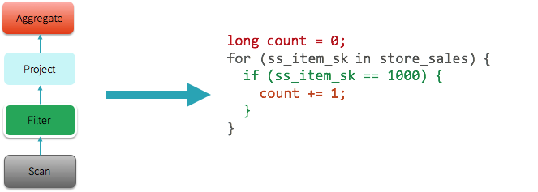

spark sql 2.3 源码解读 -  whole stage codegen (8)

whole stage codegen 是spark 2.0 以后引入的新特性，所以在最后单独把这一块拿出来讲一下。

相关背景可以看spark官方的jira：https://issues.apache.org/jira/browse/SPARK-12795a

whole stage codegen对性能有很大的提升。

如下图所示，将一棵树翻译成了一段代码执行，性能肯定会大幅提升。



codegen的更多原理以及测试结果：

https://databricks.com/blog/2016/05/23/apache-spark-as-a-compiler-joining-a-billion-rows-per-second-on-a-laptop.html

https://databricks.com/blog/2015/04/13/deep-dive-into-spark-sqls-catalyst-optimizer.html

Whole stage codegen是默认开启的：
```
`val WHOLESTAGE_CODEGEN_ENABLED = buildConf("spark.sql.codegen.wholeStage")`
    .internal()
    .doc("When true, the whole stage (of multiple operators) will be compiled into single java" +
      " method.")
    .booleanConf
    `.createWithDefault(true)`
```
其入口逻辑在preparations里：

```
protected def preparations: Seq[Rule[SparkPlan]] = Seq(
  python.ExtractPythonUDFs,
  PlanSubqueries(sparkSession),
  EnsureRequirements(sparkSession.sessionState.conf),
  CollapseCodegenStages(sparkSession.sessionState.conf),
  ReuseExchange(sparkSession.sessionState.conf),
  ReuseSubquery(sparkSession.sessionState.conf))
```

其中的CollapseCodegenStages是codegen优化的入口。

他的apply方法，如果开启了whole stage codegen，则执行相关的逻辑：

```
def apply(plan: SparkPlan): SparkPlan = {
  if (conf.wholeStageEnabled) {
    WholeStageCodegenId.resetPerQuery()
    insertWholeStageCodegen(plan)
  } else {
    plan
  }
}
```
WholeStageCodegenId就是一个递增的计数器，用来计数，resetPerQuery重置为1：
```
object WholeStageCodegenId {
  private val codegenStageCounter = ThreadLocal.withInitial(new Supplier[Integer] {
    override def get() = 1  // TODO: change to Scala lambda syntax when upgraded to Scala 2.12+
   })

  def resetPerQuery(): Unit = codegenStageCounter.set(1)

  def getNextStageId(): Int = {
    val counter = codegenStageCounter
    val id = counter.get()
    counter.set(id + 1)
    id
  }
}
```
还记得前面的physical plan 每一个stage前面带的数字1，2，...  5么，这个就是WholeStageCodegenId，用来将codegen生成的class和operator关联；前面的*号代表这个stage进行了codegen。可以看到Exchange是没有codegen的，因为它没有计算，只是一个shuffle过程。

```
*(5) Project [B#6]
+- *(5) SortMergeJoin [B#6], [B#14], Inner
   :- *(2) Sort [B#6 ASC NULLS FIRST], false, 0
   :  +- Exchange(coordinator id: 1121577170) hashpartitioning(B#6, 200), coordinator[target post-shuffle partition size: 67108864]
   :     +- *(1) Project [B#6]
   :        +- *(1) Filter isnotnull(B#6)
   :           +- *(1) FileScan json [B#6] Batched: false, Format: JSON, Location: InMemoryFileIndex[file:examples/src/main/resources/test.json], PartitionFilters: [], PushedFilters: [IsNotNull(B)], ReadSchema: struct<B:string>
   +- *(4) Sort [B#14 ASC NULLS FIRST], false, 0
      +- Exchange(coordinator id: 1121577170) hashpartitioning(B#14, 200), coordinator[target post-shuffle partition size: 67108864]
         +- *(3) Project [B#14]
            +- *(3) Filter isnotnull(B#14)
               +- *(3) FileScan json [B#14] Batched: false, Format: JSON, Location: InMemoryFileIndex[file:examples/src/main/resources/test2.json], PartitionFilters: [], PushedFilters: [IsNotNull(B)], ReadSchema: struct<B:string>
```
接下来在支持codegen的plan上面添加WholeStageCodegenExec:

```
/**
 * Inserts a WholeStageCodegen on top of those that support codegen.
 */
private def insertWholeStageCodegen(plan: SparkPlan): SparkPlan = plan match {
  // For operators that will output domain object, do not insert WholeStageCodegen for it as
  // domain object can not be written into unsafe row.
  case plan if plan.output.length == 1 && plan.output.head.dataType.isInstanceOf[ObjectType] =>
    plan.withNewChildren(plan.children.map(insertWholeStageCodegen))
  case plan: CodegenSupport if supportCodegen(plan) =>
    WholeStageCodegenExec(insertInputAdapter(plan))(WholeStageCodegenId.getNextStageId())
  case other =>
    other.withNewChildren(other.children.map(insertWholeStageCodegen))
}
```

如果有子plan不支持codegen，则在该plan上面添加InputAdapter

```
/**
 * Inserts an InputAdapter on top of those that do not support codegen.
 */
private def insertInputAdapter(plan: SparkPlan): SparkPlan = plan match {
  case p if !supportCodegen(p) =>
    // collapse them recursively
    InputAdapter(insertWholeStageCodegen(p))
  case j: SortMergeJoinExec =>
    // The children of SortMergeJoin should do codegen separately.
    j.withNewChildren(j.children.map(child => InputAdapter(insertWholeStageCodegen(child))))
  case p =>
    p.withNewChildren(p.children.map(insertInputAdapter))
}
```

一个physical plan如果想要支持 codegen，要实现CodegenSupport接口，并且重写doProduce和doConsume函数。

下面以SortExec为例,他是支持codegen的：

```
// 只看 doProduce和doConsume方法
case class SortExec(
    sortOrder: Seq[SortOrder],
    global: Boolean,
    child: SparkPlan,
    testSpillFrequency: Int = 0)
  extends UnaryExecNode with CodegenSupport {
  // 返回的string即为要执行的code
  override protected def doProduce(ctx: CodegenContext): String = {
    val needToSort = ctx.addMutableState(ctx.JAVA_BOOLEAN, "needToSort", v => s"$v = true;")

    // Initialize the class member variables. This includes the instance of the Sorter and
    // the iterator to return sorted rows.
    val thisPlan = ctx.addReferenceObj("plan", this)
    // Inline mutable state since not many Sort operations in a task
    sorterVariable = ctx.addMutableState(classOf[UnsafeExternalRowSorter].getName, "sorter",
      v => s"$v = $thisPlan.createSorter();", forceInline = true)
    val metrics = ctx.addMutableState(classOf[TaskMetrics].getName, "metrics",
      v => s"$v = org.apache.spark.TaskContext.get().taskMetrics();", forceInline = true)
    val sortedIterator = ctx.addMutableState("scala.collection.Iterator<UnsafeRow>", "sortedIter",
      forceInline = true)

    val addToSorter = ctx.freshName("addToSorter")
    val addToSorterFuncName = ctx.addNewFunction(addToSorter,
      s"""
        | private void $addToSorter() throws java.io.IOException {
        |   ${child.asInstanceOf[CodegenSupport].produce(ctx, this)}
        | }
      """.stripMargin.trim)

    val outputRow = ctx.freshName("outputRow")
    val peakMemory = metricTerm(ctx, "peakMemory")
    val spillSize = metricTerm(ctx, "spillSize")
    val spillSizeBefore = ctx.freshName("spillSizeBefore")
    val sortTime = metricTerm(ctx, "sortTime")
    s"""
       | if ($needToSort) {
       |   long $spillSizeBefore = $metrics.memoryBytesSpilled();
       |   $addToSorterFuncName();
       |   $sortedIterator = $sorterVariable.sort();
       |   $sortTime.add($sorterVariable.getSortTimeNanos() / 1000000);
       |   $peakMemory.add($sorterVariable.getPeakMemoryUsage());
       |   $spillSize.add($metrics.memoryBytesSpilled() - $spillSizeBefore);
       |   $metrics.incPeakExecutionMemory($sorterVariable.getPeakMemoryUsage());
       |   $needToSort = false;
       | }
       |
       | while ($sortedIterator.hasNext()) {
       |   UnsafeRow $outputRow = (UnsafeRow)$sortedIterator.next();
       |   ${consume(ctx, null, outputRow)}
       |   if (shouldStop()) return;
       | }
     """.stripMargin.trim
  }
  // 返回的string即为要执行的code
  override def doConsume(ctx: CodegenContext, input: Seq[ExprCode], row: ExprCode): String = {
    s"""
       |${row.code}
       |$sorterVariable.insertRow((UnsafeRow)${row.value});
     """.stripMargin
  }
```

doConsume返回的代码，doConsume负责消费input的数据，这里的逻辑是将数据插入
```
sort_sorter_0
sort_sorter_0.insertRow((UnsafeRow)inputadapter_row_0);    
```

doProduce返回的代码，doProduce负责输出数据，这里的逻辑也很简单，忽略指标统计相关的代码，就是sort_sorter_0.sort()，进行排序而已.
```
if (sort_needToSort_0) {
   long sort_spillSizeBefore_0 = sort_metrics_0.memoryBytesSpilled();
   sort_addToSorter_0();
   sort_sortedIter_0 = sort_sorter_0.sort();
   ((org.apache.spark.sql.execution.metric.SQLMetric) references[3] /* sortTime */).add(sort_sorter_0.getSortTimeNanos() / 1000000);
   ((org.apache.spark.sql.execution.metric.SQLMetric) references[1] /* peakMemory */).add(sort_sorter_0.getPeakMemoryUsage());
   ((org.apache.spark.sql.execution.metric.SQLMetric) references[2] /* spillSize */).add(sort_metrics_0.memoryBytesSpilled() - sort_spillSizeBefore_0);
   sort_metrics_0.incPeakExecutionMemory(sort_sorter_0.getPeakMemoryUsage());
   sort_needToSort_0 = false;
 }

 while (sort_sortedIter_0.hasNext()) {
   UnsafeRow sort_outputRow_0 = (UnsafeRow)sort_sortedIter_0.next();
   append(sort_outputRow_0); 
   if (shouldStop()) return;
 }
```
使用该函数可以输出所有的生成的code：

```
spark.sql("SELECT A.B FROM A JOIN C ON A.B = C.B").queryExecution.debug.codegen()
```

SortExec是stage4，看一下生成的完整的代码：
```
public Object generate(Object[] references) {
  return new GeneratedIteratorForCodegenStage4(references);
}
// 逻辑很简单，就是sort，输出
final class GeneratedIteratorForCodegenStage4 extends org.apache.spark.sql.execution.BufferedRowIterator {
  private Object[] references;
  private scala.collection.Iterator[] inputs;
  private boolean sort_needToSort_0;
  private org.apache.spark.sql.execution.UnsafeExternalRowSorter sort_sorter_0;
  private org.apache.spark.executor.TaskMetrics sort_metrics_0;
  private scala.collection.Iterator<UnsafeRow> sort_sortedIter_0;
  private scala.collection.Iterator inputadapter_input_0;
  private scala.collection.Iterator inputadapter_input_1;
  public GeneratedIteratorForCodegenStage4(Object[] references) {
    this.references = references;
  }
  public void init(int index, scala.collection.Iterator[] inputs) {
    partitionIndex = index;
    this.inputs = inputs;
    sort_needToSort_0 = true;
    sort_sorter_0 = ((org.apache.spark.sql.execution.SortExec) references[0] /* plan */).createSorter();
    sort_metrics_0 = org.apache.spark.TaskContext.get().taskMetrics();
    inputadapter_input_0 = inputs[0];
    inputadapter_input_1 = inputs[0];
  }
  private void sort_addToSorter_0() throws java.io.IOException {
    // 从input中输入, 此处是child的produce方法产生
    while (inputadapter_input_1.hasNext() && !stopEarly()) {
      InternalRow inputadapter_row_1 = (InternalRow) inputadapter_input_1.next();
      sort_sorter_0.insertRow((UnsafeRow)inputadapter_row_1);
      if (shouldStop()) return;
    }
  }
  protected void processNext() throws java.io.IOException {
    if (sort_needToSort_0) {
      long sort_spillSizeBefore_0 = sort_metrics_0.memoryBytesSpilled();
      sort_addToSorter_0();
      sort_sortedIter_0 = sort_sorter_0.sort();
      ((org.apache.spark.sql.execution.metric.SQLMetric) references[3] /* sortTime */).add(sort_sorter_0.getSortTimeNanos() / 
      ((org.apache.spark.sql.execution.metric.SQLMetric) references[1] /* peakMemory */).add(
sort_sorter_0.getPeakMemoryUsage());
      ((org.apache.spark.sql.execution.metric.SQLMetric) references[2] /* spillSize */).add(
sort_metrics_0.memoryBytesSpilled() - sort_spillSizeBefore_0);
      sort_metrics_0.incPeakExecutionMemory(sort_sorter_0.getPeakMemoryUsage());
      sort_needToSort_0 = false;
    }
    while (sort_sortedIter_0.hasNext()) {
      UnsafeRow sort_outputRow_0 = (UnsafeRow)sort_sortedIter_0.next();
      // 往output输出，此处是parent的consume方法产生
      append(sort_outputRow_0);
      if (shouldStop()) return;
    }
  }
}
```
所以codegen的思路是child plan produce 数据给 parent plan， 而 parent plan consume child plan的数据，通过这种方式，将plan串联起来，生成最终执行的code。所以各个plan需要重写 doProduce 和 doConsume方法。

最后看一下WholeStageCodegenExec的 doExecute方法：

```
override def doExecute(): RDD[InternalRow] = {
  // 得到生成的code 
  val (ctx, cleanedSource) = doCodeGen()
  // try to compile and fallback if it failed
  val (_, maxCodeSize) = try {
  // 编译code
    CodeGenerator.compile(cleanedSource)
  } catch {
    case _: Exception if !Utils.isTesting && sqlContext.conf.codegenFallback =>
      // We should already saw the error message
      logWarning(s"Whole-stage codegen disabled for plan (id=$codegenStageId):\n $treeString")
      return child.execute()
  }

  // Check if compiled code has a too large function
  if (maxCodeSize > sqlContext.conf.hugeMethodLimit) {
    logInfo(s"Found too long generated codes and JIT optimization might not work: " +
      s"the bytecode size ($maxCodeSize) is above the limit " +
      s"${sqlContext.conf.hugeMethodLimit}, and the whole-stage codegen was disabled " +
      s"for this plan (id=$codegenStageId). To avoid this, you can raise the limit " +
      s"`${SQLConf.WHOLESTAGE_HUGE_METHOD_LIMIT.key}`:\n$treeString")
    child match {
      // The fallback solution of batch file source scan still uses WholeStageCodegenExec
      case f: FileSourceScanExec if f.supportsBatch => // do nothing
      case _ => return child.execute()
    }
  }

  val references = ctx.references.toArray

  val durationMs = longMetric("pipelineTime")

  val rdds = child.asInstanceOf[CodegenSupport].inputRDDs()
  assert(rdds.size <= 2, "Up to two input RDDs can be supported")
  if (rdds.length == 1) {
    rdds.head.mapPartitionsWithIndex { (index, iter) =>
    // 编译code，生成类。使用了Janino。
      val (clazz, _) = CodeGenerator.compile(cleanedSource)
      // 反射生成code的实例
      val buffer = clazz.generate(references).asInstanceOf[BufferedRowIterator]
      // 执行逻辑
      buffer.init(index, Array(iter))
      new Iterator[InternalRow] {
        override def hasNext: Boolean = {
          val v = buffer.hasNext
          if (!v) durationMs += buffer.durationMs()
          v
        }
        override def next: InternalRow = buffer.next()
      }
    }
  } else {
    // Right now, we support up to two input RDDs.
    rdds.head.zipPartitions(rdds(1)) { (leftIter, rightIter) =>
      Iterator((leftIter, rightIter))
      // a small hack to obtain the correct partition index
    }.mapPartitionsWithIndex { (index, zippedIter) =>
      val (leftIter, rightIter) = zippedIter.next()
      val (clazz, _) = CodeGenerator.compile(cleanedSource)
      val buffer = clazz.generate(references).asInstanceOf[BufferedRowIterator]
      buffer.init(index, Array(leftIter, rightIter))
      new Iterator[InternalRow] {
        override def hasNext: Boolean = {
          val v = buffer.hasNext
          if (!v) durationMs += buffer.durationMs()
          v
        }
        override def next: InternalRow = buffer.next()
      }
    }
  }
}
```

逻辑不复杂，就是通过Janino编译代码生成类，通过反射实例化并执行。

whole stage codegen 的介绍就到这里了。其实原理并没有想象的复杂，大家仔细阅读源码肯定能搞明白。