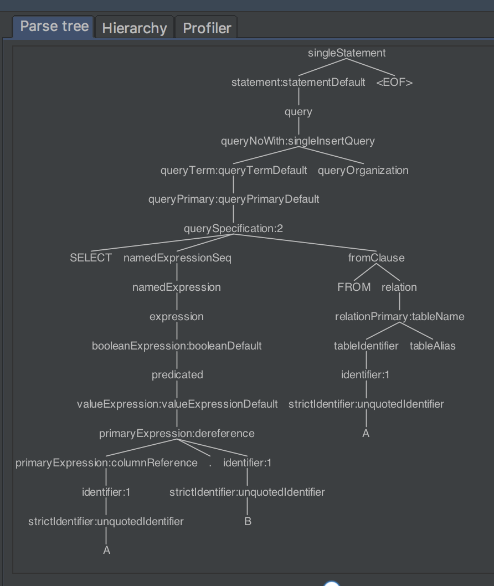

spark sql 2.3 源码解读 - antlr4 && SparkSqlParser (2.3)

​    接着上一节，继续讲。还是以 SELECT A.B FROM A 为例。



​    查看AstBuilder逻辑，遍历访问，最终会访问到querySpecification节点：

```
override def visitQuerySpecification(
    ctx: QuerySpecificationContext): LogicalPlan = withOrigin(ctx) {
  val from = OneRowRelation().optional(ctx.fromClause) {
    visitFromClause(ctx.fromClause)
  }
  withQuerySpecification(ctx, from)
}
```
​      optional用的比较多，放一下它的逻辑，其实很简单：

```
     /**
     * Create a plan using the block of code when the given context exists. Otherwise return the
     * original plan.
     */
    def optional(ctx: AnyRef)(f: => LogicalPlan): LogicalPlan = {
      if (ctx != null) {
        f
      } else {
        plan
      }
    }

    /**
     * Map a [[LogicalPlan]] to another [[LogicalPlan]] if the passed context exists using the
     * passed function. The original plan is returned when the context does not exist.
     */
    def optionalMap[C](ctx: C)(f: (C, LogicalPlan) => LogicalPlan): LogicalPlan = {
      if (ctx != null) {
        f(ctx, plan)
      } else {
        plan
      }
    }
```

​      FROM 语句解析，因为有join的情况，所以写的比较复杂，我们的sql比较简单，就是返回一个relation

```
/**
 * Create a logical plan for a given 'FROM' clause. Note that we support multiple (comma
 * separated) relations here, these get converted into a single plan by condition-less inner join.
 */
override def visitFromClause(ctx: FromClauseContext): LogicalPlan = withOrigin(ctx) {
  val from = ctx.relation.asScala.foldLeft(null: LogicalPlan) { (left, relation) =>
    val right = plan(relation.relationPrimary)
    val join = right.optionalMap(left)(Join(_, _, Inner, None))
    withJoinRelations(join, relation)
  }
  ctx.lateralView.asScala.foldLeft(from)(withGenerate)
}
```
​     对WHERE 等语句解析，有些逻辑还是很复杂，我们只需要关注自己的sql：
```
/**
 * Add a query specification to a logical plan. The query specification is the core of the logical
 * plan, this is where sourcing (FROM clause), transforming (SELECT TRANSFORM/MAP/REDUCE),
 * projection (SELECT), aggregation (GROUP BY ... HAVING ...) and filtering (WHERE) takes place.
 *
 * Note that query hints are ignored (both by the parser and the builder).
 */
private def withQuerySpecification(
    ctx: QuerySpecificationContext,
    relation: LogicalPlan): LogicalPlan = withOrigin(ctx) {
  import ctx._

  // WHERE
  def filter(ctx: BooleanExpressionContext, plan: LogicalPlan): LogicalPlan = {
    Filter(expression(ctx), plan)
  }

  // Expressions. 也就是要查询的内容
  val expressions = Option(namedExpressionSeq).toSeq
    .flatMap(_.namedExpression.asScala)
    .map(typedVisit[Expression])

  // Create either a transform or a regular query.
  val specType = Option(kind).map(_.getType).getOrElse(SqlBaseParser.SELECT)
  specType match {
    case SqlBaseParser.MAP | SqlBaseParser.REDUCE | SqlBaseParser.TRANSFORM =>
      // Transform

      // Add where.
      val withFilter = relation.optionalMap(where)(filter)

      // Create the attributes.
      val (attributes, schemaLess) = if (colTypeList != null) {
        // Typed return columns.
        (createSchema(colTypeList).toAttributes, false)
      } else if (identifierSeq != null) {
        // Untyped return columns.
        val attrs = visitIdentifierSeq(identifierSeq).map { name =>
          AttributeReference(name, StringType, nullable = true)()
        }
        (attrs, false)
      } else {
        (Seq(AttributeReference("key", StringType)(),
          AttributeReference("value", StringType)()), true)
      }

      // Create the transform.
      ScriptTransformation(
        expressions,
        string(script),
        attributes,
        withFilter,
        withScriptIOSchema(
          ctx, inRowFormat, recordWriter, outRowFormat, recordReader, schemaLess))
	// 我们的是select语句
    case SqlBaseParser.SELECT =>
      // Regular select

      // Add lateral views.
      val withLateralView = ctx.lateralView.asScala.foldLeft(relation)(withGenerate)

      // Add where.
      val withFilter = withLateralView.optionalMap(where)(filter)

      // Add aggregation or a project.
      val namedExpressions = expressions.map {
        case e: NamedExpression => e
        case e: Expression => UnresolvedAlias(e)
      }
      val withProject = if (aggregation != null) {
        withAggregation(aggregation, namedExpressions, withFilter)
      } else if (namedExpressions.nonEmpty) {
        // 我们的sql语句的返回结果
        Project(namedExpressions, withFilter)
      } else {
        withFilter
      }

      // Having
      val withHaving = withProject.optional(having) {
        // Note that we add a cast to non-predicate expressions. If the expression itself is
        // already boolean, the optimizer will get rid of the unnecessary cast.
        val predicate = expression(having) match {
          case p: Predicate => p
          case e => Cast(e, BooleanType)
        }
        Filter(predicate, withProject)
      }

      // Distinct
      val withDistinct = if (setQuantifier() != null && setQuantifier().DISTINCT() != null) {
        Distinct(withHaving)
      } else {
        withHaving
      }

      // Window
      val withWindow = withDistinct.optionalMap(windows)(withWindows)

      // Hint
      hints.asScala.foldRight(withWindow)(withHints)
  }
}
```
​    最终返回的是 Project(namedExpressions, withFilter)，他继承了LogicalPlan
```
case class Project(projectList: Seq[NamedExpression], child: LogicalPlan) extends UnaryNode {
  override def output: Seq[Attribute] = projectList.map(_.toAttribute)
  override def maxRows: Option[Long] = child.maxRows

  override lazy val resolved: Boolean = {
    val hasSpecialExpressions = projectList.exists ( _.collect {
        case agg: AggregateExpression => agg
        case generator: Generator => generator
        case window: WindowExpression => window
      }.nonEmpty
    )

    !expressions.exists(!_.resolved) && childrenResolved && !hasSpecialExpressions
  }

  override def validConstraints: Set[Expression] =
    child.constraints.union(getAliasedConstraints(projectList))
}
```
​     我们断点调试一下，结果确实是这样：


​     从上面我们也已经看到了LogicalPlan是Tree，每一个节点都继承自TreeNode.  Spark Sql 的LogicalPlan、Expression、PhysicalPlan全都是用Tree表示的，后面都会讲到。

这次提到的LogicalPlan有三个子类：

1. UnaryNode 一元节点,即只有一个子节点。如 Limit、Filter 操作
2. BinaryNode 二元节点,即有左右子节点的二叉节点。如 Join、Union 操作
3. LeafNode 叶子节点,没有子节点的节点。主要用户命令类操作,如SetCommand.

sql语句经过解析，得到上面三种节点构成的Tree，用于后续流程。